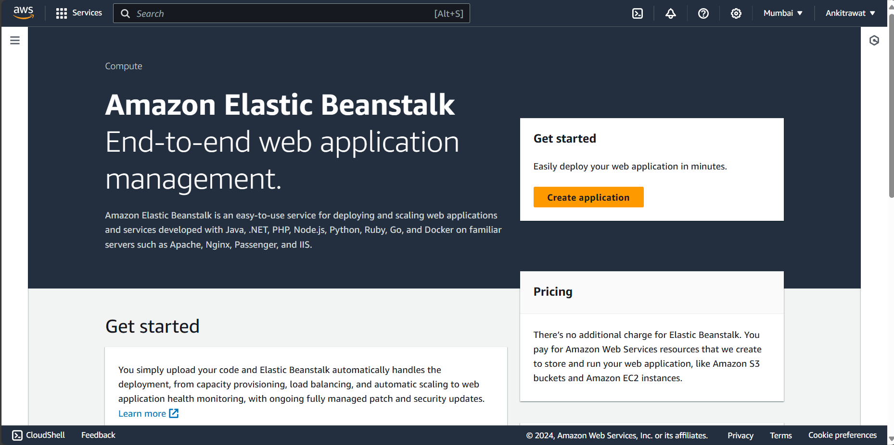
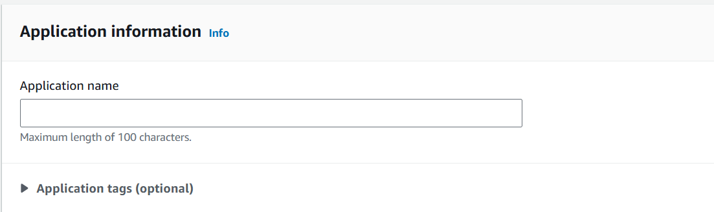
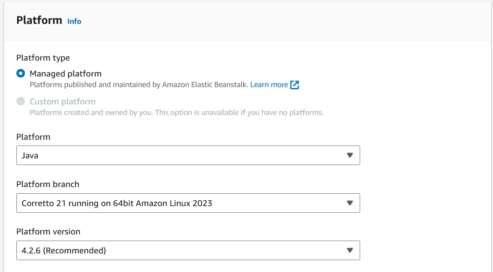
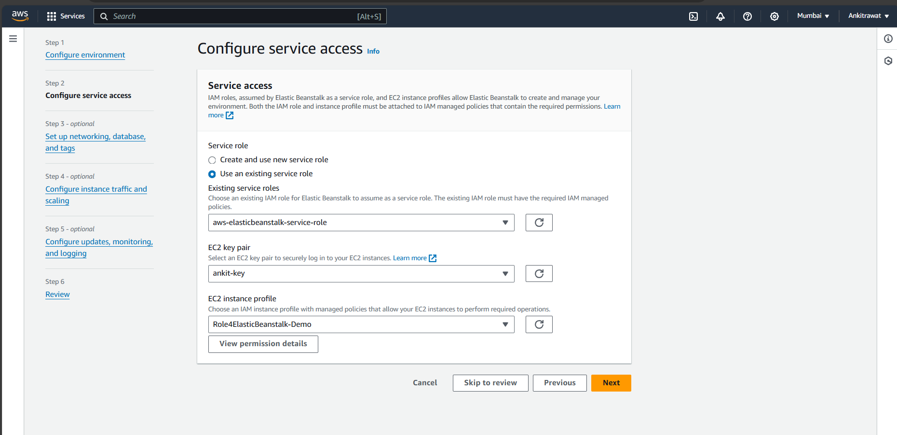
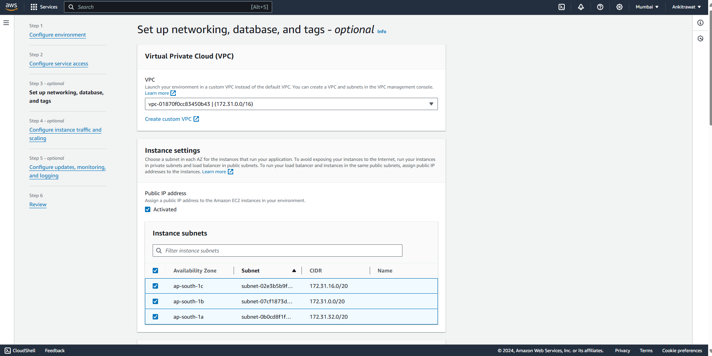
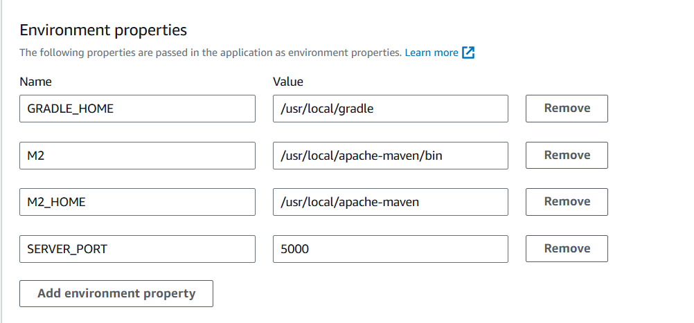
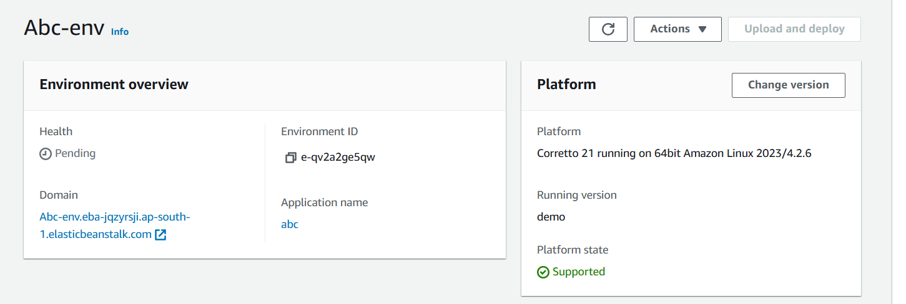
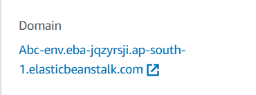

Pre-requisite
*   account on aws 

# [Application deploy on EBS](https://aws.amazon.com/ebs/?nc2=type_a)

## Click on the create application 

###       1.Write the name of the application you want  
###       2.Choose plateform(java)   
            1.Click sample application for testing purpose if you dont have your own 
.png) 
            2.Upload your code 
.png) 
###       3.Click on local file and select the jar file form the system .png) 
            Click next
###       4.If you are first time using then click on create and use new service role  
            Click on next
###       5.Select VPC(virtual private cloud)  
###       6.Under instance settings 
            Check activate the public ip address
###       7.Select all the availabilty zone(optional)
            Click next
###       8.Set environment properties and enter the SERVER_PORT = 5000(default port)  
            Then review form and submit it
###       9.Click dashboard of application and click on the dns url   

*Note: After using services make sure you stop that service*