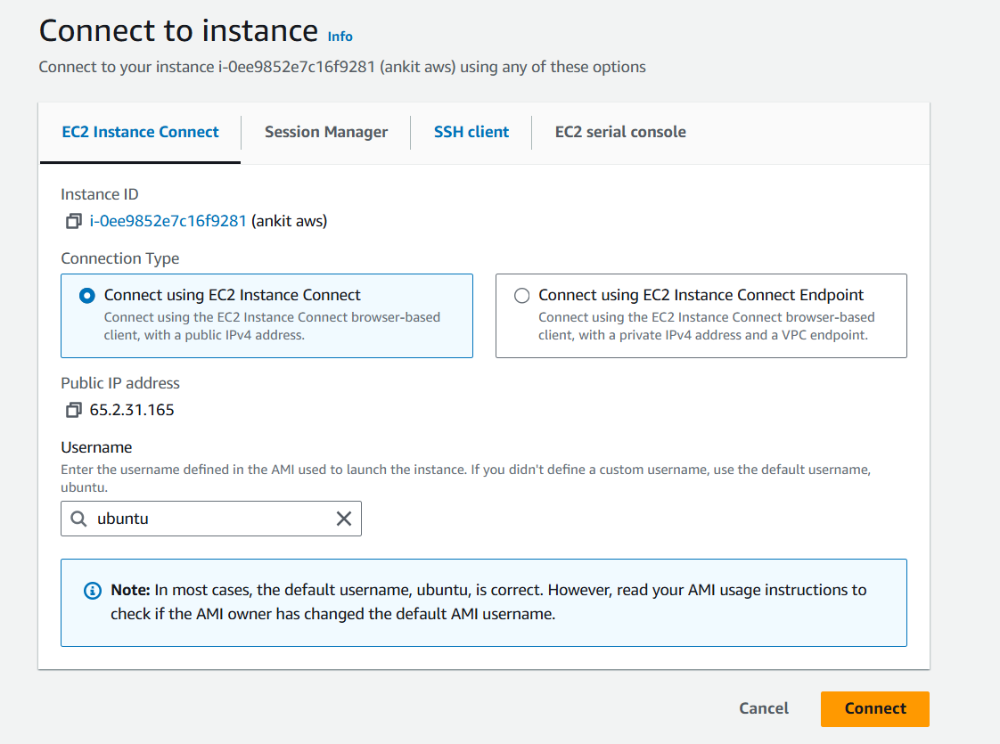
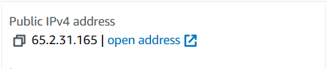

# Application deploy on EC2 instance
##  Search EC2 in the aws dashboard

###       Create instance (virtual machine) 

####      Click on launch instance  

*            Write the name of your instance 

*            Select OS

*            Select instance type (t2 micro is free tier) 
 
*            Select key pair to access the instance 
 
                    If not created then create fresh one by clicking create new key
                        Enter the name of key 
                        And click on the create key
*            In the network setting open https and http port by checking the box
  
*            Click the launch instance

###     Click on the instance id and click on the connect  
 
            Then there are several ways to access the instance 
                    1. EC2 instance connect
  

                        Click on the connect 
 
                    2. SSH client 
 
                        Copy the ssh command and open window terminal go to that directory where your key-pair.pem key present and paste it on the terminal
 
###     Create a fresh folder for the project(spring-boot) in the ubuntu machine 
 
            now your jar file copy under that folder from your local machine to remote machine by command 

###    Write this cmd on your local machine
 
            `scp -i location/of/your-key-pair-file source(file-to-transfer) detination(username@ip:location)`
            eg- `scp -i download/ankit-key.pem c:Dekstop/abc.jar ubuntu@12.143.124.12:/home/ubuntu/spring-boot`

###     Open your ubuntu machine and check jar file is there or not if yes  
 
            then run your jar file from that location by cammand "java -jar abc.jar"
 

###     Copy the public ip of remote machine and paste it on the browser 
 

            "112.124.54.64:8080"
 

*Note: After using services make sure you stop that service*