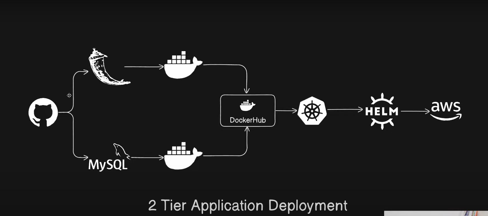

### Two Tier Application


Pre-reqiusite:- 
-> docker installed and configured on the system 

How to dockerize the project of two-tier application this is my dockerfile for frontend  
make dockerfile :-

```
FROM python:3.9-slim
WORKDIR /app

RUN  apt-get update -y \
        && apt-get upgrade -y \
        && apt-get install apt-utils \
        && apt-get install -y gcc default-libmysqlclient-dev pkg-config \
        && rm -rf /var/lib/apt/list/*

COPY requirements.txt .

RUN pip install mysqlclient
RUN pip install -r requirements.txt

COPY . .

CMD ["python" , "app.py"]
```
note:- If container is not running then check the logs of that container

---
### This is without docker-compose 
1. Build flaskapp image from docker file :- 
`
docker build -t flaskapp .
`

2. Create network:-  This is because both backend and front end container will connected with each oth on same network

so in this project we have to create 2 containers one is flask and other is db and we have to connect with each other without compose so what we can do is we create a network and run or create both container in that network

Create network:-
`docker network create twotier`

check network list :-
`docker network ls`

check inside the network :-
`docker network inspect network-name`

Before next step please check that all the configuration are same written in the app.py file please make sure that all the configuration are same if any missconfiguration then it will give an error 

3. Run mysql container :- 
```
docker run --name mysql-container --network twotier \  #same network
    -e MYSQL_ROOT_PASSWORD=root \     #this is same pasword in mysql 
    -e MYSQL_DB=devops \
    -e MYSQL_USER=admin \ 
    -e MYSQL_PASSWORD=admin \
    -d mysql:5.7
```
Note :- this after that you may face an error that database is not foud then you have to create database by entring in the container by the name of you provided in the above

4. Run flaskapp container :- Run the application from the images which I build from my dockerfile
```
docker run -d \
    --name flaskapp-cont \
    --network=twotier \
    -e MYSQL_HOST=mysql-container \  #this is same name of the mysql conaitner
    -e MYSQL_USER=root \
    -e MYSQL_PASSWORD=root \     #this is same pasword in mysql conaitner
    -e MYSQL_DB=devops \         #this is mysqldb.it is same in mysql
    -p 5000:5000 \
    flaskapp
```
   1. Open 5001 port on the instance :-
                img

   2. Your application deploy sucessfully:- 
                img

If You want to add or view data from the terminal then firstly You want to interact with mysql conatiner then after that You can run some query
For going inside the terminal:- `docker exec -it mysql-container mysql -uroot -p`
    enter password `root`
  1. list databses:- `SHOW DATABASES;`

  2. Select the Database:- `USE devops;`

  3. List Tables :- `SHOW TABLES;`

  4. Run sql Query :- 
```
SELECT * FROM messages;   #show all the data 

INSERT INTO messages (message) VALUES ('Hello, world!');    #Inserting the data from terminal 

exit            #exit from the Mysql shell 
```
---

### This is with docker-compose

Pre-requisite:-  `sudo apt install docker-compose-v2`
Make docker-compose file:-
```
version: '3.9'
services:
  mysql:
    container_name: mysql
    image: mysql:5.7
    platform: linux/x86_64
    ports:
      - "3306:3306"
    environment:
      MYSQL_ROOT_PASSWORD: root     #used for login or entering in the mysql container in terminal
      MYSQL_DATABASE: devops
      MYSQL_USER: admin
      MYSQL_PASSWORD: admin
    volumes:
      # - ./message.sql:/docker-entrypoint-initdb.d/message.sql   # Mount sql script into container's /docker-entrypoint-initdb.d directory to get table a>
      - mysql-data:/var/lib/mysql  # Mount the volume for MySQL data storage
    networks:
      - twotier
    healthcheck:
      test: ["CMD", "mysqladmin", "ping", "-h", "localhost", "-u", "root", "-p$MYSQL_ROOT_PASSWORD"]
      interval: 10s
      retries: 5
      start_period: 30s

  flask-app:
    build:
      context: .
    ports:
      - "5001:5000"
    environment:
      MYSQL_HOST: mysql
      MYSQL_USER: root
      MYSQL_PASSWORD: root
      MYSQL_DB: devops
    depends_on:
      mysql:
        condition: service_healthy

    networks:
      - twotier

volumes:
  mysql-data:
networks:
  twotier:
    driver: bridge
```
Note make sure all the configuration is matched with app.py file's configuration
`docker compose up -d`
`docker compose down`


