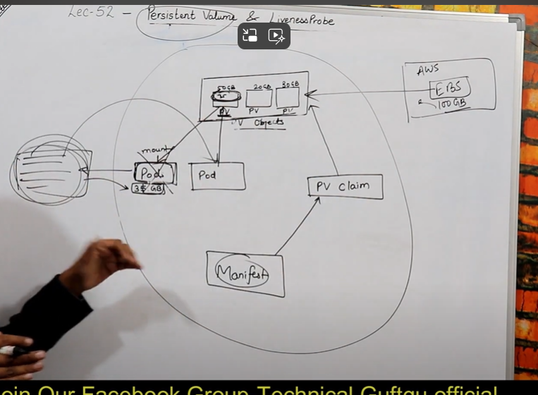

## kubernetes objects
- kubernetes uses object to represnet th estate of your cluster 

- what containeized application are running (and on which node )

- the policies around how those applications behave ,such as restart polices ,upgrades and fault tolrence

- once you create the object , the kubernetes system will contantly work to ensure that object exist and maintain's cluster's desired states

- every kubernetes object include two nested fields that govern the object config the object spec and the object status

- the spec ,which we provide ,describes your desired stste for the object - the characteristic that you want the object to have 

- the status descirbed the actual state of the object and is supplied and updated by the kubernetes system 

- All object are identifiede by a unique name and a UID

**The basic kubernestes object include**
1. Pod
2. Service
3. Volume
4. Namespace
5. Replicasets
6. Secrets
7. ConfigMaps
8. Deployments
9. Jobs
10. Daemonsets

**Relationship between these object**
- Pod manages Containers
- Replicaset manage pods 
- Services expose pod processes to the Outside world
- Configmaps and secrets helps you config pods

**kubernestes object**
- It represent as JSAN or YAML files
- You create these and then push them to the kubernetes api with kubectl

**States of the object**
- Replicas (2/2)
- Images(Tomcate/ubuntu)
- Name
- Port
- Volume
- startup
- Detached (default)

**kubernestes configuration**
1. All-in-one Single node installation
2. Single-node etcd , single-Master and Multi-worker installation
3. Single-node etcd , Multi-master and Multi-worker installation

Commands:

To show the nodes :
`kubectl get nodes`
To show the nodes with detail :
`kubectl describe node node-name`
To create simple manifest file:
kind: Pod
apiVersion: V1
metadata:
 name: testpod
spec:
 containers:
  - name: c00
    image: ubuntu
    command: ["/bin/bash","-c","while true;do echo Hello-Ankit ; sleep 5 ;  done"]

 restartPolicy: Never

To create the pods:
`kubectl apply -f pod1.yml`

To watch the running pods:
`kubectl get pods`

To watch the detail of pod:
`kubectl get pods -o wide`

`kubectl describe pod testpod`
or
`kubectl describe pod/testpod`

Watch inside the container(if there is only sinlge container in the pod):
`kubectl logs -f testpod`

If there are many container in the pod then how can we see in the container:
`kubectl logs -f testpod -c c00 `

Delete the pod:
`kubectl delete pod testpod`

Create annotation:-it is for just description for that anyone understand the manifest file by reading the description

----
**MULTI CONTAINER POD ENVIRONMENT**

kind: Pod
apiVersion: v1
metadata:
  name: testpod3
spec:
  containers:
    - name: c00
      image: ubuntu
      command: ["/bin/bash", "-c", "while true; do echo Technical-Guftgu; sleep 5 ; done"]
    - name: c01
      image: ubuntu
      command: ["/bin/bash", "-c", "while true; do echo Hello-Bhupinder; sleep 5 ; done"]

To check the ip of pod:- 
`kubectl exec testpod3 -c c01 -- hostname -i`

To enter in the fucking contianer :-
`kubectl exec testpod3 -it -c c02 -- /bin/bash`

----
**POD ENVIRONMENT  VARIABLES**

kind: Pod
apiVersion: v1
metadata:
  name: environments
spec:
  containers:
    - name: c00
      image: ubuntu
      command: ["/bin/bash", "-c", "while true; do echo Hello-Bhupinder; sleep 5 ; done"]
      env:                        # List of environment variables to be used inside the pod
      - name: MYNAME
        value: ANKIT

`echo $MYNAME`

----
**POD WITH PORTS**
kind: Pod
apiVersion: v1
metadata:
  name: testpod4
spec:
  containers:
    - name: c00
      image: httpd
      ports:
       - containerPort: 80 
 
`kubctl apply -f pod4.yml`
`kubctl get pods`
`kubctl get pods -o wide`
`curl 172.14.15.16:80`
`kubectl delete -f pod4.yml`

**label and selector**
`kubectl label pods delhipod myname=ankit`
`kubectl get pods --show-label`

Now ,list pods matching a label:
`kubectl get pods -l env=development`

Now ,list pods matching a label is not present:
`kubectl get pods -l env!=development`

Now ,if you want to delete pod using label:
`kubectl delete pods -l env=development`

`kubctl get pods`

Equality Based: (=,!=)
name: ankit
class: nodes
project: develpoment

set based:(in,notin and exist)
  env in (production,dev)
  env notin (team1,team2)

kubernetes also supports set-based selector i.e match multiple values

`kubectl get pods -l 'env in (development,testing)'`
`kubectl get pods -l 'env notin (development,testing)'`
`kubectl get pods -l class=pods,myname=ankit`

----

**EXAMPLE OF LABELS**

kind: Pod
apiVersion: v1
metadata:
  name: delhipod
  labels:           
    env: development
    class: pods
spec:
    containers:
       - name: c00
         image: ubuntu
         command: ["/bin/bash", "-c", "while true; do echo Hello-Bhupinder; sleep 5 ; done"]

----
**NODE SELECTOR EXAMPLE**

kind: Pod
apiVersion: v1
metadata:
  name: nodelabels
  labels:
    env: development
spec:
    containers:
       - name: c00
         image: ubuntu
         command: ["/bin/bash", "-c", "while true; do echo Hello-Bhupinder; sleep 5 ; done"]
    nodeSelector:
       hardware: t2-medium
----
To assign label on the node so that pod will create on that node:-
`kubectl label nodes minikube hardware=t2-medium`

----
**scaling and replication**
Need for multiple container/replication help us with these
- Reliabilty :- By having multiple versions of an application , you prevent problem if one or more fails
- Load Balanceing :- Having multiple version of containers enable you to easily send traffic to different instance to prevent overloading of a single insances or node
- Scaling :- When load does become too much for the number of eisting instances,kubernetes enable you to easily scale up your application ,adding additional instances as needed
- Rolling update :- updates to a service by replacing pods one by one

**Replication controller**
- A replication controller is a object that enable you to easily create multiple pods ,then make sure that number of pods always exist
- if a pod create using RC will be automatically replaced if they does crash ,failed ,or terminated
- RC is recommended if you just want to make sure 1 pod is always running ,even after systm reboots
- You can run the RC with 1 replica & the RC will make sure the pod is always running

eg:-
----
**EXAMPLE OF REPLICATION CONTROL**

kind: ReplicationController   #this define to create the object of replication type             
apiVersion: v1
metadata:
  name: myreplica
spec:
  replicas: 2  #this eliment define the desired number of pods       
  selector:  #tells the container which pods to watch/belong to this rc
    myname: Ankit #this must match the labels                             
  template:  #template element define a template to launch a new pod         
    metadata:
      name: testpod6
      labels:   #selector values need to match the labels values specified in the pod template
        myname: Ankit 
    spec:
     containers:
       - name: c00
         image: ubuntu
         command: ["/bin/bash", "-c", "while true; do echo Hello-Ankit; sleep 5 ; done"]

`kubectl apply -f myrc.yml`
`kubectl get rc`
`kubectl describe rc myreplica`
`kubectl get pods`
`kubectl delete pod myreplica-h9b4f`
`kubectl get pods`
`kubectl describe rc myreplica`
`kubectl get pods --show-labels`

To scale up or down the pods numbers
`kubectl scale --replicas=8 rc -l myname=ankit`

To delte the replication object we have to delete the yml file fro that becouse if we delte by pods then it will automatically create new one 
`kubectl delete -f myrc.yml`

----
**Replica Set**
- Replica set is a next generation replication container
- The replication controller only supports equality-based selector whereas the replica set supports set-based selector i.e filtering according to set of values 
- Replicaset rather than the Replication Controller is used by other objects like deployment

----
**EXAMPLE OF REPLICA SET**
kind: ReplicaSet                                    
apiVersion: apps/v1                            
metadata:
  name: myrs
spec:
  replicas: 2  
  selector:                  
    matchExpressions:                             # these must match the labels
      - {key: myname, operator: In, values: [Bhupinder, Bupinder, Bhopendra]}
      - {key: env, operator: NotIn, values: [production]}
  template:      
    metadata:
      name: testpod7
      labels:              
        myname: Bhupinder
    spec:
     containers:
       - name: c00
         image: ubuntu
         command: ["/bin/bash", "-c", "while true; do echo Technical-Guftgu; sleep 5 ; done"]

`kubectl scale --replicas=1 rs myrs`
`kubectl delete rs myrs`

----
**Deployment and Rollback**
Replication Controller & Replica set is not able to do update & Rollback apps in the cluster

- A deployment object act as a supervisor for pods ,giving you fine-gained control over how and when a new pod is rolled out ,updated or rolled back to a previous state

- when using deployment object ,we first define the state of the app ,then k8s cluster schedules mentioned app instance onts specific individual nodes

- A deployment provides declarative updates for pods and replicaset

- k8s then monitors ,if the node hosting an instance goes down or pod is deleted the deployment controller replaces it 

- this provides a self-healing mechanism to address machine failure or maintence

----
- if there are problem in the deployment ,kubernetes will automatically roll back to the previous version ,however you can also explicitly rollback to a specific revision ,as in our case eto revision 1(the original pod version)

- You can rollback to a specific version by specifying with `--to-revision`
  for eg -> `kubectl rollout undo deploy/mydeployments --to-revision=2`

- **note** :- that the name of the replicasset is always formatted as [Deployment-name] - [Rondom string]
cmd -> kubectl get deploy

<u>when you inspect the deployments in your cluster ,the following field are display</u>
- NAME :- list the names of the deployment in the namespace
- READY :- Display the number of replicas that have been updated to achieve the desired state
- AVAILABLE :- Display how many replicas of the application are available to your users
- AGE :- Display the amount of time that the application has been running
----
kind: Deployment
apiVersion: apps/v1
metadata:
   name: mydeployments
spec:
   replicas: 2
   selector:     
    matchLabels:
     name: deployment
   template:
     metadata:
       name: testpod
       labels:
         name: deployment
     spec:
      containers:
        - name: c00
          image: ubuntu
          command: ["/bin/bash", "-c", "while true; do echo Technical-Guftgu; sleep 5; done"]

- To check the deployment was created or not
`kubectl get deploy`
`kubectl get kind:type`
`kubectl get Deployment`

- To check ,how deployment create RS and pods
`kubectl describe deploy mydeployments`
`kubectl describe Deployment mydeployments`
`kubectl getrs`

- To scale up or scale down
`kubectl scale --replicas=1 deploy mydeployments` 
`kubectl scale --replicas=1 Deployment mydeployments` 

- To check ,what is running inside container
`kubectl logs -f <podname>`
`kubectl rollout status deployment mydeployments`
`kubectl rollout history deployment my deployments`
`kubectl rollout undo deploy/mydeployments`

----

**Failed deployment**
your deployment may get stuck trying to deploy its newest Replicaset without ever completing. this can occure due to same of the following factor
1. Insufficient Quota(resources): eg node space insufficent
2. Readiness probe failures
3. Image pull errors
4. Insufficient permission
5. limit Ranges
6. Application runtime misconfiguration

## Networking in container
**communication of two container with in the pods**

----
kind: Pod
apiVersion: v1
metadata:
  name: testpod
spec:
  containers:
    - name: c00
      image: ubuntu
      command: ["/bin/bash", "-c", "while true; do echo Hello-Bhupinder; sleep 5 ; done"]
    - name: c01
      image: httpd
      ports:
       - containerPort: 80

there are two container c00 and c01 in single pod
then `kubectl exec testpod -it -c c00 -- /bin/bash`
this command to enter in the container 1 which has ubuntu image and then i have to execute curl `localhost:80` to check whether it is connected to container 2 or not.There is apache in the container 2

----

**communication of two container with two different pods with in the same node**

- Pod to pod communication on same worker node happens through pod ip 
- By default pod's ip will not be accessible outside the node
  
<u>cont-com-diff-pod1.yml</u>
kind: Pod
apiVersion: v1
metadata:
  name: testpod1
spec:
  containers:
    - name: c00
      image: ubuntu
      ports:
       - containerPort: 80

<u>cont-com-diff-pod2.yml</u>
  
kind: Pod
apiVersion: v1
metadata:
  name: testpod1
spec:
  containers:
    - name: c00
      image: ubuntu
      ports:
       - containerPort: 80

then `kubectl apply -f cont-com-diff-pod1.yml`
then `kubectl apply -f cont-com-diff-pod1.yml`
to start pod then to watch pod with ip
`kubectl get pods -o wide`
to enter in the pod:-
`kubectl exec testpod1 -it -c c01 -- /bin/bash`
then `curl ip:80`

---- 
**Services**
- when using RC ,pods are terminated and created during scalling or replication operations.
- when using deployments ,while updating the images version the pods are terminated and new pods take the place of other pods
- pods are very dynamic i.e they come and go on the k8 cluster and on any of the available nodes and it would be difficult to acces the pods as he pods ip changes onces its recreated
- Service object is an logical bridge between pods and end user, which provides virtual ip (vip)
- service allow client to reliabilty connect to the container running in the pod using the VIP
- the VIP is not an actual ip connected to a network interface , bot its purpose is purely to forward trafic to one or more pods
- kube proxy is the one which keeps the mapping between the VIP and the pods upto date ,which queries the API server to learn about new services in cluster
- although ech pods has a unique ip address,those ips are not exposed outside the cluster
- service help to expose the vip mapped to pods and allows applicaiton to receive traffic 
- labels are used to select which are the pods to be put under a service 
- creating a service will create an endpoint to access the pods/application
- service can be exposed in differnet ways by specipying a type in the service spec:
  - cluster Ip
  - Nodeport :- 
    - Makes a service accesible form the outside the cluster
    - Express the service on the smae port of each sleected node in the cluster using NAT
  - LoadBalancer : created by cloud providers that will route external traffice to every node on the Nodeport(eg ELB on AWS)  
  - Headless :- Creates seeral endpoint that are used to produce DNS Record Each DNS record is bound to a pod
- By default service can run only between port 30,000 - 32,767
- The set of pods targeted by a service is usually determined by a sector 

----
this is my replica yml file
kind: Deployment
apiVersion: apps/v1
metadata:
   name: mydeployments
spec:
   replicas: 1
   selector:      # tells the controller which pods to watch/belong to
    matchLabels:
     name: deployment
   template:
     metadata:
       name: testpod1
       labels:
         name: deployment
     spec:
      containers:
        - name: c00
          image: httpd
          ports:
          - containerPort: 80

----
this is my service yml file:- it is for virtual private ip so that why we create deployment replica

kind:Service                             # Defines to create Service type Object
apiVersion: v1
metadata:
  name: demoservice
spec:
  ports:
    - port: 80                               # Containers port exposed
      targetPort: 80                     # Pods port
  selector:
    name: deployment                    # Apply this service to any pods which has the specific label
  type: ClusterIP                       # Specifies the service type i.e ClusterIP or NodePort

----

then want to watch the sercies `kubectl get svc`
this cammand use to check container properly connected with each other or not
`minikube ssh curl 10.111.247.165:80`

**Volumes**
- Container are short lived in nature  
- All data stored inside a container is deleted if the container crashes.however the kubelet will restart it with a clean state , which means that it will not have any of the old data
- To overcome this problem ,kubernetes uses Volume .A volume is essentially a directory backed by a storage medium. The storage medium and its content are determined by the volume type
- [imp] In kubernetes , a volume is attached to a pod and shared among the container of that pod
- [imp] The volume has the same life span as the pod , and it outlives the container of the pod this allows data to be preserved accros container restarts

**Volume types**
- A volume type decide the properties of the directory, like size ,content etc some eg of volume types are :-
- node-local type such as emptydir and hostpath
- file sharing types such as nfs
- cloud provider-specific types like awselasticeblockstore , azuredisk
- distributed file system type for example glusterfs or cephfs
- special purpose type like secrete ,gitrepo

----
Vloume labs:-

apiVersion: v1
kind: Pod
metadata:
  name: myvolemptydir
spec:
  containers:
  - name: c1
    image: centos
    command: ["/bin/bash", "-c", "sleep 15000"]
    volumeMounts:                                    # Mount definition inside the container
      - name: xchange
        mountPath: "/tmp/xchange"          
  - name: c2
    image: centos
    command: ["/bin/bash", "-c", "sleep 10000"]
    volumeMounts:
      - name: xchange
        mountPath: "/tmp/data"
  volumes:                                                   
  - name: xchange
    emptyDir: {}

    
kubectl apply -f emptydir.yml
kubectl get pods
To enter inside the container one : `kubectl exec myvolemptydir -c c1 -it -- /bin/bash`
  - After entering the container we have to check that the volume is shared or not. so we can do cd tmp/xchange 
  - then create the file in that directory for eg - abc.yml
  - then check that the same file is present in the container 2 becouse of the volumes 
To enter inside the container two : `kubectl exec myvolemptydir -c c2 -it -- /bin/bash`
  - then we can got to the cd tmp/data and then watch the same file present inside that folder that we created in container one and now we are in second container and if we change or update in that file then it will update in the first container automatically
  
----

**Hostpath**
- It is use to create a file in the host machine to share container data in that file when the container is dead tha data will remain there
- use this when we wnat to acces the content of a pod/container from hostmachine
- A hostpoth volume mount a file or directory from the host node's filesystem into your pod

----
Hostpath

apiVersion: v1
kind: Pod
metadata:
  name: myvolhostpath
spec:
  containers:
  - image: centos
    name: testc
    command: ["/bin/bash", "-c", "sleep 15000"]
    volumeMounts:
    - mountPath: /tmp/hostpath
      name: testvolume
  volumes:
  - name: testvolume
    hostPath:
      path: /tmp/data 

----
**Persistent Volume and LivenessProbe**
always available 

----
**PERSISTENT VOLUME**

apiVersion: v1
kind: PersistentVolume
metadata:
  name: myebsvol
spec:
  capacity:
    storage: 1Gi
  accessModes:
    - ReadWriteOnce
  persistentVolumeReclaimPolicy: Recycle
  awsElasticBlockStore:
    volumeID:           # YAHAN APNI EBS VOLUME ID DAALO
    fsType: ext4

this is for persistenetvolume:`kubectl get pv`

----

**PERSISTENT VOLUME CLAIM**

apiVersion: v1
kind: PersistentVolumeClaim
metadata:
  name: myebsvolclaim
spec:
  accessModes:
    - ReadWriteOnce
  resources:
    requests:
      storage: 1Gi

this is for persistenetvolumeclaim: `kubectl get pvc`

---- 

**DEPLOYMENTFILE FOR PERSISTENT VOLUME**

apiVersion: apps/v1
kind: Deployment
metadata:
  name: pvdeploy
spec:
  replicas: 1
  selector:      # tells the controller which pods to watch/belong to
    matchLabels:
     app: mypv
  template:
    metadata:
      labels:
        app: mypv
    spec:
      containers:
      - name: shell
        image: centos
        command: ["bin/bash", "-c", "sleep 10000"]
        volumeMounts:
        - name: mypd
          mountPath: "/tmp/persistent"
      volumes:
        - name: mypd
          persistentVolumeClaim:
            claimName: myebsvolclaim

----

**Healthcheck/LivenessProbe**
- A pod is considered ready when all pf its containers are ready 
- In order to verify if a container in a Pod is helthy and ready to serve traffic , kubernetes provides for range of heaalthy checking mechanism 
- Helathy check use for application inside the container is working properly or not

----
apiVersion: v1
kind: Pod
metadata:
  labels:
    test: liveness
  name: mylivenessprobe
spec:
  containers:
  - name: liveness
    image: ubuntu
    args:
    - /bin/sh
    - -c
    - touch /tmp/healthy; sleep 1000
    livenessProbe:                                          
      exec:
        command:                                         
        - cat                
        - /tmp/healthy
      initialDelaySeconds: 5          
      periodSeconds: 5                                 
      timeoutSeconds: 30          

----

**Configmap and Secrets**
- While performing application deployment on k8s cluster, somtime we need to change the application configuration file depending on environments like dev ,QA stage or prod

- Changing this application configuration file means we need to change source code, commit the change , creating a new image and then go through the complete deployment process

- Hence these configurations should be decoupled from images content in order to keep containersed application portable 

- This is where kubernetes configuration comes handy It allows us to handle configuration file much more effiecintly

- Configuration are usefull for storing and shering non-sensitive ,unencryted configurtion

- Configuration can be used to store fine-grained information like individual properties or entire configuration

- Configuration are not interded to act as a replacement for a properties file

- Configmap can be accessed in following ways: -
  1. As environment variables
  2. As volumes in the pod

kubectl create configmap < mapname> -- from - file = < file to read>

| SECRTES |
--  

you don't want sensitive information such as a database password or an api key kept around in clear text

- Secrets provide you with a mechanism to use such information in a safe and Rreliable way with the following properties: -
- Secrets are namespaced onjects ,that is exist in the context of a namespace
- You can access them via a volume or an enviraonmetn variable form a container running in a pod
- The secret data on node is stored in tmpfs volumes (tmpfs is a file system which keeps all is a file systme which keeps all file in virtual memory everything in tmpfs is temporary in the sense that no file will be created on your hard drives) 
- A per-secrete size limit of 1 MB exist
- The API server stores secrets as plaintext in etcd 
  - Secrets can be created 
     1. from a text file 
     2. from a yaml file

----
To create configuration file :- `nano sample.conf`
To create objectc :- `kubectl create configmap mymap --from-file=sample.conf`
To watch configmap object :- `kubectl get configmap`
To watch it with detail :- `kubectl describe configmap mymap`

 apiVersion: v1
kind: Pod
metadata:
  name: myvolconfig
spec:
  containers:
  - name: c1
    image: centos
    command: ["/bin/bash", "-c", "while true; do echo Technical-Guftgu; sleep 5 ; done"]
    volumeMounts:
      - name: testconfigmap
        mountPath: "/tmp/config"   # the config files will be mounted as ReadOnly by default here
  volumes:
  - name: testconfigmap
    configMap:
       name: mymap   # this should match the config map name created in the first step
       items:
       - key: sample.conf
         path: sample.conf

To enter in the container :- `kubectl exec myvolconfig -it -- /bin/bash`
then `cd /tmp`
then `ls`
then `cd sample.conf`

---
apiVersion: v1
kind: Pod
metadata:
  name: myenvconfig
spec:
  containers:
  - name: c1
    image: centos
    command: ["/bin/bash", "-c", "while true; do echo Technical-Guftgu; sleep 5 ; done"]
    env:
    - name: MYENV         # env name in which value of the key is stored
      valueFrom:
        configMapKeyRef:
          name: mymap      # name of the config created
          key: sample.conf

----

This is for creating username file with root content in it and same as passwrd:- `echo "root" > username.txt; echo "mypassword123" > password.txt`

To make these file in secrte information then `kubectl create secret generic mysecret --from-file=username.txt --from-file=password.txt`
this information is not visible to anyone it is a sensitive information

To watch the secret object : -`kubectl get secret`
Now how to send this sceret in the container :-

apiVersion: v1
kind: Pod
metadata:
  name: myvolsecret
spec:
  containers:
  - name: c1
    image: centos
    command: ["/bin/bash", "-c", "while true; do echo Technical-guftgu; sleep 5 ; done"]
    volumeMounts:
      - name: testsecret
        mountPath: "/tmp/mysecrets"   # the secret files will be mounted as ReadOnly by default here
  volumes:
  - name: testsecret
    secret:
       secretName: mysecret  

`kubectl apply -f deploysecret.yml`
`kubectl get pod`
`kubectl exec myvolsecret -it -- /bin/bash`
`cd tmp/mysecret`
`ls`

next:-
1. https://www.youtube.com/watch?v=rBeyHDKLVqM&t=2525s&pp=ygUYa3ViZXJuZXRlcyBpbiBvbmUgdmlkZW8g

kubenetstes live project:-
2. https://www.youtube.com/watch?v=9tl0A_rwgu4&pp=ygUYa3ViZXJuZXRlcyBpbiBvbmUgdmlkZW8g

k8s live project:-
3. https://www.youtube.com/watch?v=LPaWASGjwbs&pp=ygUYa3ViZXJuZXRlcyBpbiBvbmUgdmlkZW8g

4. https://www.youtube.com/watch?v=7XDeI5fyj3w&pp=ygUbYmFzaWMgcHJvamVjdCBpbiBrdWJlcm5ldGVz

-this is end to end pipeline project
5. https://www.youtube.com/watch?v=KvL_FGs--a0&list=PLlfy9GnSVerRqYJgVYO0UiExj5byjrW8u&index=3

- this is deploying liv project nginx with docker
6. https://www.youtube.com/watch?v=xkLQ6xzZZhU&list=PLlfy9GnSVerRqYJgVYO0UiExj5byjrW8u&index=18&t=5198s

- this is a three tier application:-
7. https://www.youtube.com/watch?v=YlUa3t9Aaic&list=PLlfy9GnSVerRqYJgVYO0UiExj5byjrW8u&index=23&t=116s

- this for github + docker + dokcerhub + ec2 + jenkins 
8. https://www.youtube.com/watch?v=AaVO1Mvr3q4&t=3882s